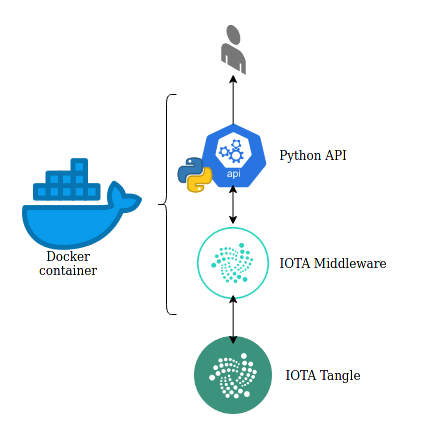
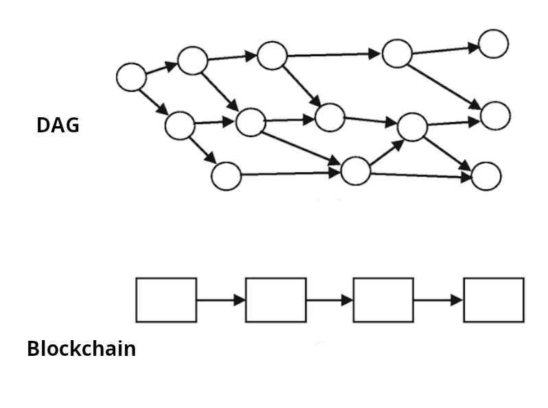
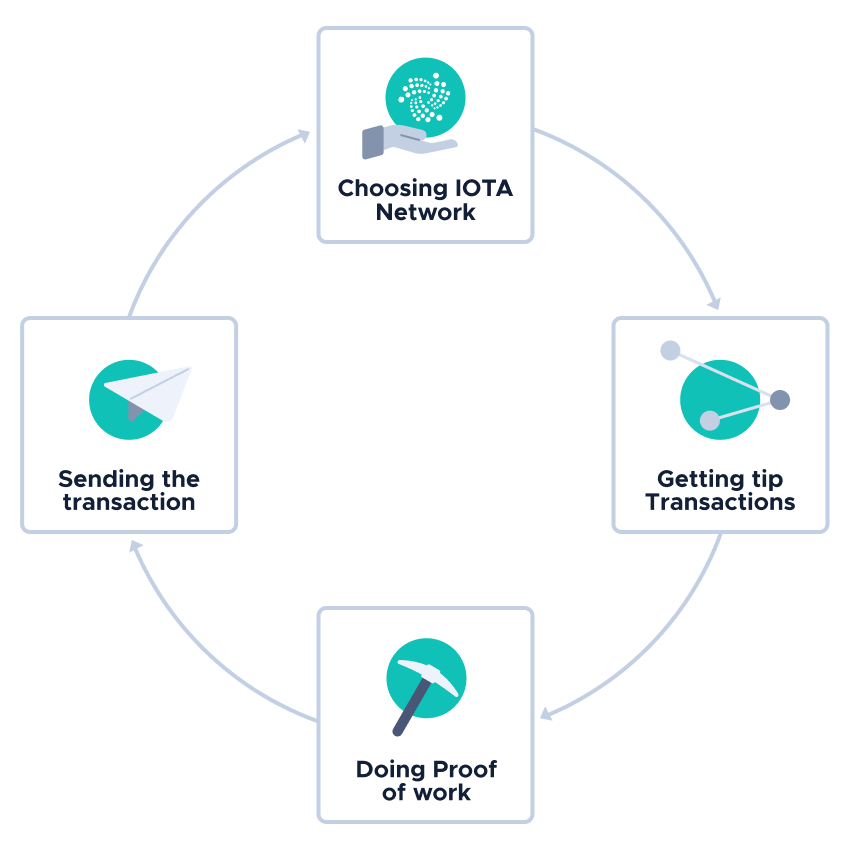
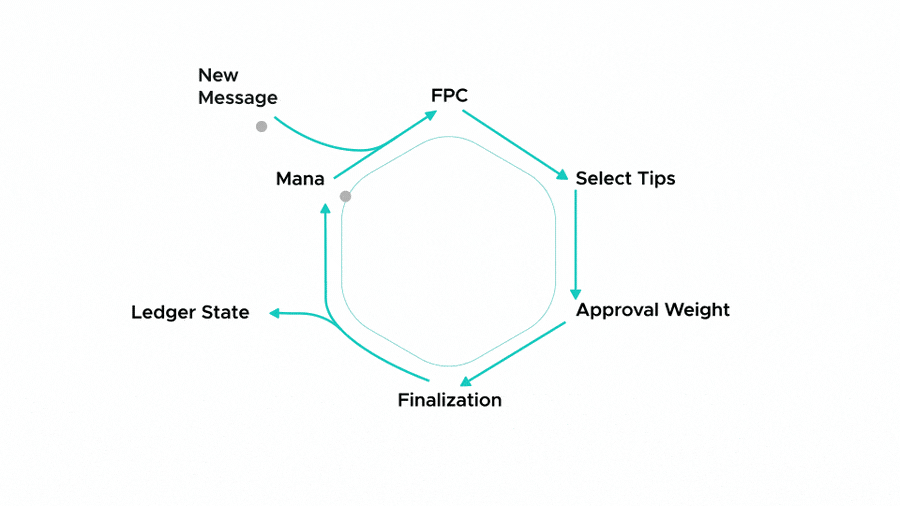

# Attendance checker for any meeting using the IOTA Tangle
### Table of Contents
1. [About this project](#about-this-project)
1. [What is IOTA](#what-is-iota)

### About this project
System that checks the attendance to any meeting based on transactions realized in the IOTA Tangle network.

This system benefits from the feeless IOTA network and the better scalability that IOTA provides when increasing the number of transactions. 
Refer to: [What is IOTA](#what-is-iota)



#### Install

**Requirements**
* Docker
* Docker Compose
* Python v3.9
* Flask

1. Build the Docker image

    ```bash
    docker build -t iota-api:v0.0.1 . 
    ```

1. Run the Docker image

    ```bash
    docker run -d --name iota-api --restart always -p 5000:5000 iota-api:v0.0.1 
    ```

#### API Endpoints

* Send a transaction
    > POST /api/v1/send

    body:
    ```json
    {
    "meeting_id": "1234",
    "description" : "Fundamentals of IOTA",
    "user_id" : "555",
    "username" : "Ruben",
    "timestamp" : "07/10/2021 - 11:53:45"
    }
    ```
* Query by meeting ID
    > GET /api/v1/meeting/{id}

* Query by user ID
    > GET /api/v1/user/{id}

### What is IOTA

Main issues with a common Blockchain Network (e.g. Bitcoin)


1. **Scalability**

    * Bitcoin's blockchain takes about 10 min to confirm a transaction.
    * +200K unconfirmed transactions at a time.
    * Bad for micro-payments (buy a coffee).

1. **Transactions per second (TPS)**
    
    * Visa - 2000 TPS
    * Paypal - 155 TPS
    * Ethereum - 100 TPS
    * Bitcoin - 5-7 TPS

    * IOTA - 1000+ TPS 

1. **Fees**

    * Need to pay a fee per transaction.
    * The fee can be larger than the transaction itself.

1. **Computing mining power**
    * More computing power on each block.
    * Transaction speed declines as network increases (need to validate more transactions).
    * Mining is centralized by giant mining pools.

1. **Vulnerable to quantum computer**

    * A quantum computer is 17 billion times more efficient in calculating a hash (51% control of the network attack).


##### IOTA uses a DAG (Directed Acyclic Graph)



* High transaction throughput (paralellizing transaction validations).
* More participants -> less confirmation time.

##### No miners

* Blockchain: Participants of the network decoupled into miners and users, miners compete with each other and users only send/receive transactions (centralization can occur, mining pools).

* IOTA: A transaction validates two past transactions, members are both participants of the consensus and users.

##### No transaction fees

* All the network is involved in the approval of transactions (not only a small subset part of the consensus (only miners)), as a result the consensus is not decoupled from the transaction make process, hence no need to pay fees.

##### Quantum computer resistant

* Uses winternitz one time signature.

#### Transaction process (IOTA v1.1)



1. **Select IOTA Network**: Choose a node that is going to be the entry point to the Tangle, IOTA networks can be private (Hornet) or permissionless (Mainnet, Devnet, Comnet)


1. **Unconfirmed transactions selection (tips)**: Using a tip selection algorithm, select **two** unconfirmed transactions, which will be referenced by your transaction.

1. **Proof of Work**: Physically limits the amount of messages one node can make. For this, we use an adaptive PoW as a rate control mechanism. For honest nodes, the PoW difficulty is relatively low. But if a node begins to spam, the difficulty exponentially increases, physically preventing them from issuing more messages. So, this mechanism would prevent the system from being completely overloaded.

1. **Sign the transaction:** For example sending tokens from A to B, to prove to nodes that A is indeed the owner of the IOTA tokens in his address, **A signs an input transaction** with his private key. This **input transaction withdraws** 10 i from his address.
B then creates an **output transaction to deposit** that 10 i into A's address. This transaction **does not need a signature** because it is not withdrawing IOTA tokens.
Then B puts all the transactions in a bundle and sends them to a node on an IOTA network.
1. **Broadcast transaction to the network**: Broadcast the transaction to the network, someone chooses your transaction in the tip selection and validates it, then your transaction is confirmed.

#### Sending a transaction process (IOTA v2.0)

Nodes vote on new conflicts through our voting protocol, FPC, which determines which branches should be rejected. FPC voting is protected from attackers by mana, a reputation system which fairly limits who can vote. After FPC rejects bad branches, tips are selected from the correct branches for new messages to reference. As these correct branches gain more messages, we say that their approval weight grows. Once a branch gets enough approval weight, its transactions are finalized and booked to the ledger, and mana is updated determining the next FPC voters.

>**Note**: this process is used in IOTA DevNet ver 2.0, fully decentralized https://v2.iota.org/how-it-works/decentralized

#### Definitions

**Minimum Weight Magnitude (MWM)**
A setting for proof of work that defines the number of trailing zeros that a transaction hash must have to be accepted by nodes in an IOTA network

**Double Spend Attack**
Send a fake transaction record to the destinatary while keeping the original amount due to the long confirmation time, or sending multiple packets to the network after receiving the counterparty’s assets or services, thus keeping both the received goods and the sent amount) This process makes any attempt to duplicate or falsify the blockchain significantly more difficult to execute, because the attacker would have to go back and re-mine every single block with the new fraudulent transaction(s) on it. 

**Coordinator and Milestones (IOTA v1.1)**
Transactions in the Tangle are confirmed by special transactions called milestones that are sent by a client called the Coordinator, removed and fully decentralized in v2.0.

**Proof of Work Remote/Local, Transaction bundle**
In the transaction process: 
* First, we construct a **transaction bundle**. The bundle groups together all the individual transactions which relate to a single intent of value transfer. The constructed bundle is signed with your private keys.
* Second, we randomly choose two previous unapproved transactions, or tips to approve. This will allow us to join the Tangle. We can get two tips from IRI via *getTransactionsToApprove*.
* Third, is Proof of Work(PoW). To join Tangle every transaction in the bundle requires a nonce. The nonce is the result of PoW.

The Proof of Work can be done on the device locally or it can be delegated to external devices.

**IRI**
The IRI (**IOTA Reference Implementation**) is open-source Java software that runs on the IOTA Mainnet as well as the Devnet. This software defines the current IOTA protocol, which allows nodes to do the following:

* Validate transactions
* Store valid transactions in a ledger
* Allow clients to interact with the them through a an HTTP API


#### More IOTA v2.0 documentation
https://github.com/iotaledger/IOTA-2.0-Research-Specifications

